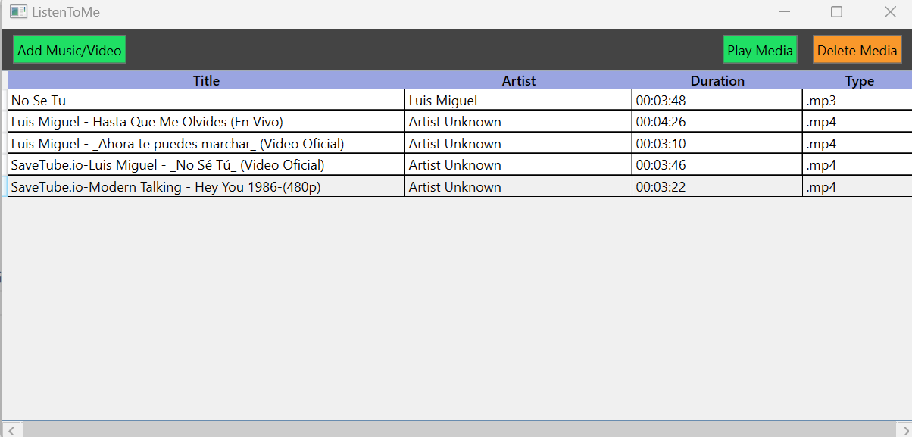
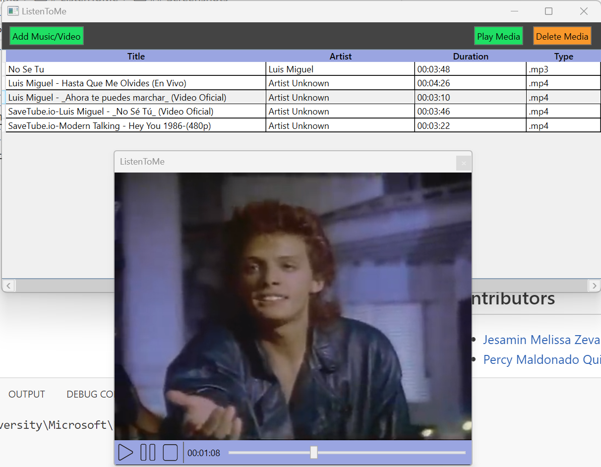

# ListenToMe
Music player developed on .Net, using the MVVM architecture.

- Model
  - Media (Music or Video)
- View
  - Main Window
  - Play Window
- ViewModel
  - Media List
  - Play Media

## Run
```console
$ dotnet run
```

## Software
1.  Visual Studio Code
2.  PowerShell Pro Tools
3.  C#
4.  .Net 7
5.  Github

## Screenshots
- Main Window
  - 
- Play Window
  - 
  
## Contributors
- [Jesamin Melissa Zevallos Quispe](https://github.com/Jesamin-30)
- [Percy Maldonado Quispe](https://github.com/maldonadoq)
